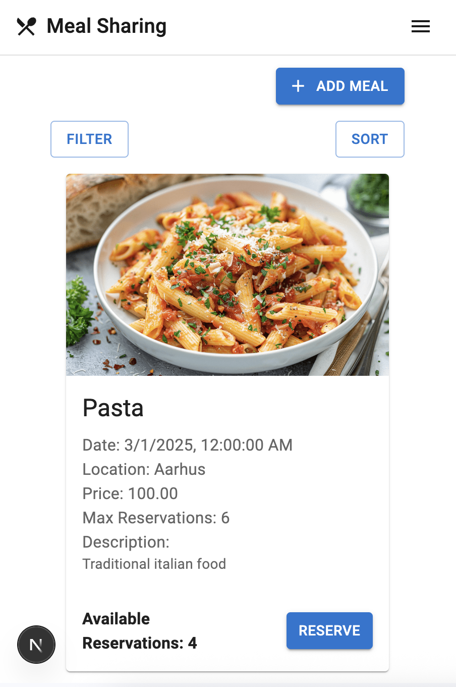
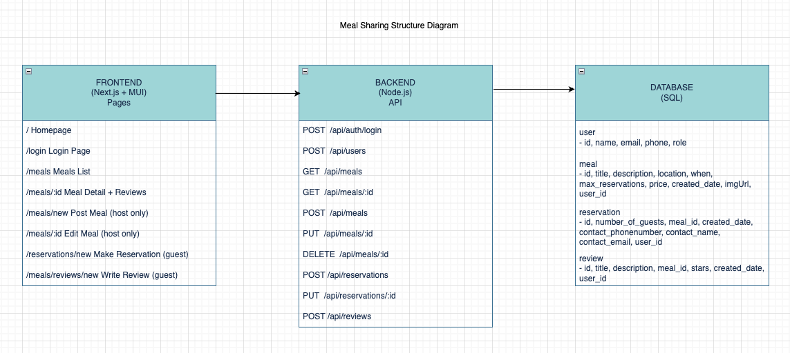

# 🍽️ Meal Sharing App

This is a full-stack web application built with **React, Next.js, JavaScript**, and a **Node.js + mySQL backend**, and styled with **Material UI**. It is created as an individual project task for Hack Your Future Denmark's [curriculum](https://github.com/HackYourFuture-CPH/curriculum). Meal Sharing App is a responsive web application where users can browse, share, and discover home-cooked meals, the project emphasizes user experience, clean design, and full-stack development skills.

---

## 🖼️ Screenshots

| Desktop View                                                               | Mobile View                                                              |
| -------------------------------------------------------------------------- | ------------------------------------------------------------------------ |
|  |  |

---

## 🌐 Deploy Website (ongoing)

> Deployment in progress.

## 🔧 Tech Stack

### Frontend

- [Next.js](https://nextjs.org/) (App Router)
- [React](https://reactjs.org/)
- [Material UI](https://mui.com/)
- Responsive layout with custom Navbar, Drawer, Search Tool, and Theme Toggle

### Backend

- [Node.js](https://nodejs.org/)
- [Express.js](https://expressjs.com/)
- [MySQL](https://www.mysql.com/)
- RESTful API for meals, reservations, and reviews

---

## ✨ Features

- 🏠 **Homepage** with introduction and featured meals
- 🍛 **Meal List**: Browse all available meals, each meal details also with reviews and available reservations
- 🔍 **Search Tool** with input and action button
- 📱 **Responsive Navigation** with Hamburger Menu on mobile
- 🔐 **User Login & Authentication** -- in progress

---

## 🗂️ Project Structure

### Project Diagram

 
 
---

## Getting started

> Before you start, make sure no other projects are running, in order to have the ports free.

To get started you'll need two terminals.

In the first terminal run the following commands:

```
cd api
cp .env-example .env
npm install
npm run dev
```

You can then test the API using [Postman](https://www.postman.com/) at [http://localhost:3001/api](http://localhost:3001/api).

In the second terminal run the following commands:

```
cd app
npm install
npm run dev
```

You can then open the web app at [http://localhost:3000](http://localhost:3000).
